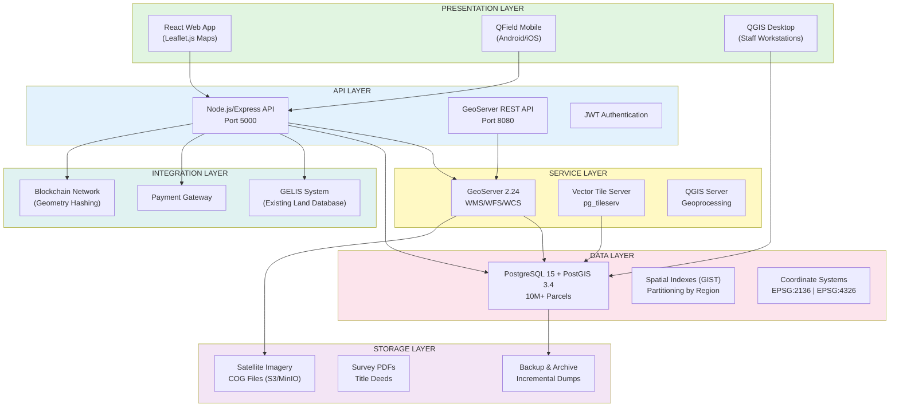
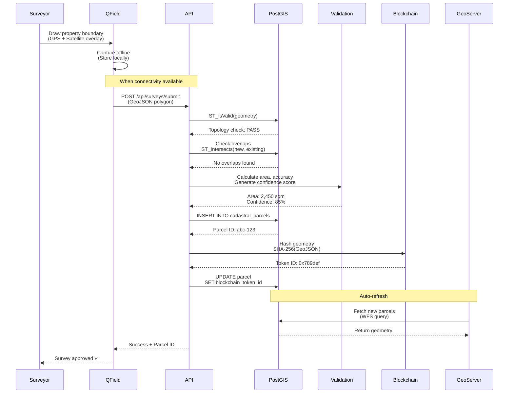
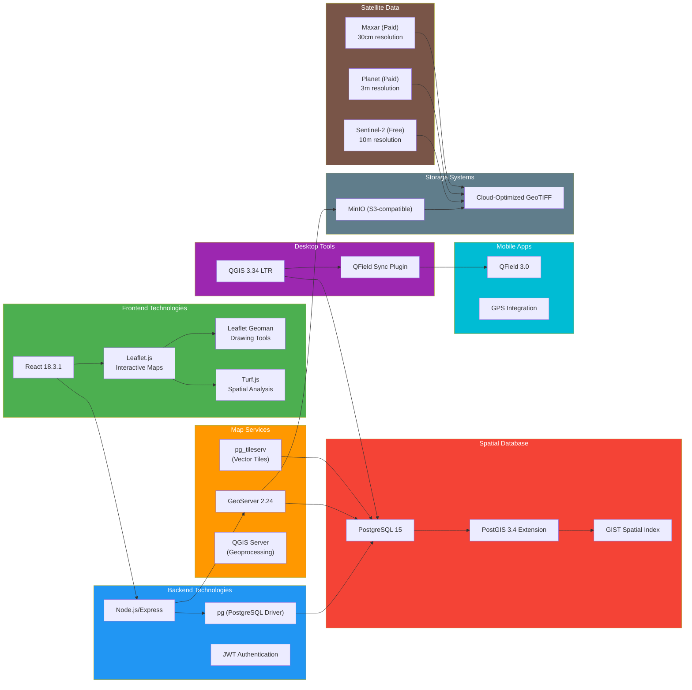
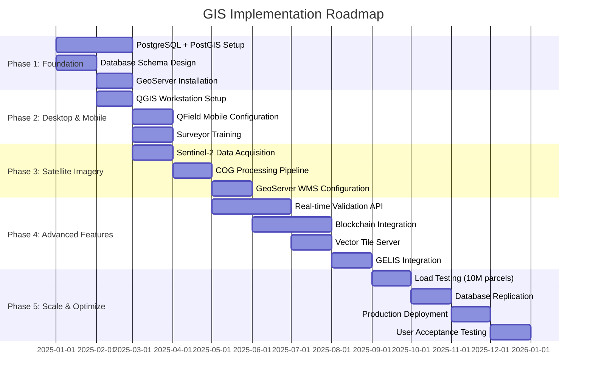
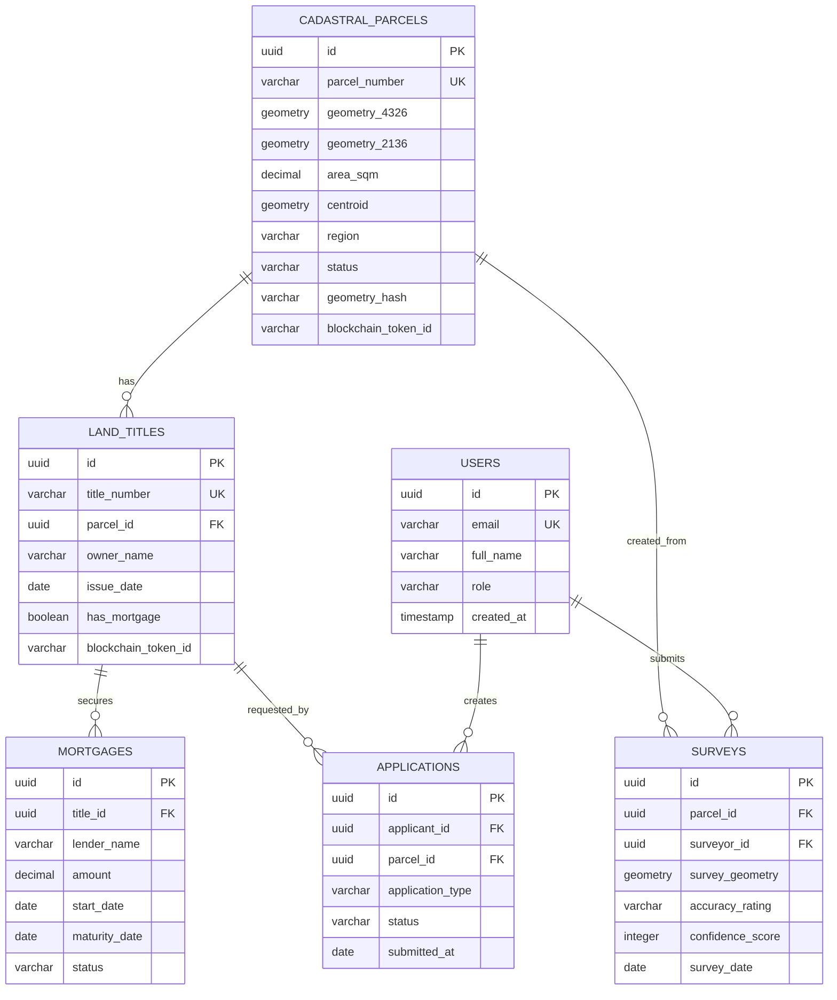
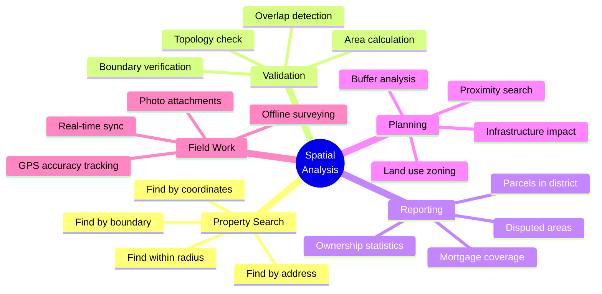
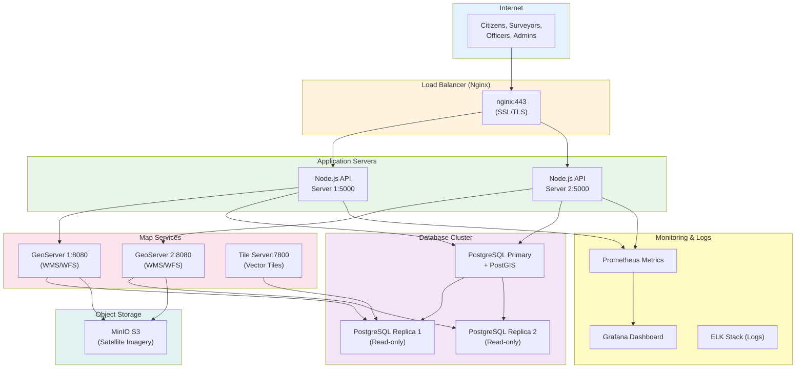
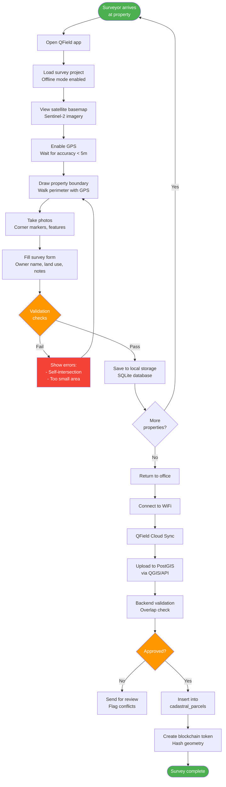

# Ghana Lands Commission - GIS Architecture Diagrams
**Visual representation of the recommended GIS solution**

---

## 1. System Architecture - Six Layer Overview

---

## 2. Data Flow - Survey Submission Process

---

## 3. Technology Stack Components

---

## 4. Spatial Query Flow - Find Parcels in Area

```mermaid
flowchart LR
    subgraph User["User Actions"]
        Draw["User draws polygon<br/>on map (Leaflet Geoman)"]
    end

    subgraph Client["Client-Side Processing"]
        GeoJSON["Convert to GeoJSON<br/>{type: 'Polygon', coordinates: [...]}"]
        API_Call["POST /api/spatial/analyze-area"]
    end

    subgraph Server["Server-Side Processing"]
        Parse["Parse GeoJSON"]
        Query1["PostGIS Query 1:<br/>ST_Intersects(parcel.geom, area)"]
        Query2["PostGIS Query 2:<br/>Find titles WHERE parcel_id IN (...)"]
        Query3["PostGIS Query 3:<br/>Find mortgages WHERE title_id IN (...)"]
        Stats["Calculate Statistics:<br/>- Total area<br/>- Count properties<br/>- Count titles<br/>- Count mortgages"]
    end

    subgraph Database["Database Execution"]
        Index["Use GIST Index<br/>(Fast spatial search)"]
        Filter["Filter by status, region"]
        Join["JOIN titles, mortgages"]
        Return["Return results"]
    end

    subgraph Response["Response to Client"]
        JSON["JSON Response:<br/>{parcels: [], titles: [],<br/>mortgages: [], stats: {}}"]
        Render["Render on map:<br/>- Highlight parcels<br/>- Show statistics<br/>- Display tables"]
    end

    Draw --> GeoJSON
    GeoJSON --> API_Call
    API_Call --> Parse
    Parse --> Query1
    Query1 --> Index
    Index --> Filter
    Filter --> Query2
    Filter --> Query3
    Query2 --> Join
    Query3 --> Join
    Join --> Stats
    Stats --> Return
    Return --> JSON
    JSON --> Render

    style User fill:#e8f5e9
    style Client fill:#e3f2fd
    style Server fill:#fff3e0
    style Database fill:#fce4ec
    style Response fill:#f3e5f5
```

---

## 5. Implementation Timeline (12 Months)

---

## 6. Database Schema - Entity Relationships

---

## 7. Spatial Analysis - Use Cases

---

## 8. Cost Comparison: Open Source vs ESRI

```mermaid
graph TD
    subgraph OpenSource["Open Source Solution - $181k Year 1"]
        OS_DB["PostgreSQL + PostGIS<br/>$0 (Free)"]
        OS_Server["GeoServer<br/>$0 (Free)"]
        OS_Desktop["QGIS (20 licenses)<br/>$0 (Free)"]
        OS_Mobile["QField<br/>$0 (Free)"]
        OS_Imagery["Sentinel-2 + Planet<br/>$20k/year"]
        OS_Services["Professional Services<br/>$161k (one-time)"]
    end

    subgraph ESRI["ESRI Solution - $250k Year 1"]
        ESRI_DB["ArcGIS Enterprise SDE<br/>$50k/year"]
        ESRI_Server["ArcGIS Server<br/>$40k/year"]
        ESRI_Desktop["ArcGIS Pro (20 licenses)<br/>$30k/year"]
        ESRI_Mobile["ArcGIS Field Maps<br/>$10k/year"]
        ESRI_Imagery["ArcGIS Imagery<br/>$25k/year"]
        ESRI_Services["Implementation Services<br/>$95k (one-time)"]
    end

    OS_DB --> OS_Total["Year 1: $181k<br/>Year 2+: $81k/year"]
    OS_Server --> OS_Total
    OS_Desktop --> OS_Total
    OS_Mobile --> OS_Total
    OS_Imagery --> OS_Total
    OS_Services --> OS_Total

    ESRI_DB --> ESRI_Total["Year 1: $250k<br/>Year 2+: $200k/year"]
    ESRI_Server --> ESRI_Total
    ESRI_Desktop --> ESRI_Total
    ESRI_Mobile --> ESRI_Total
    ESRI_Imagery --> ESRI_Total
    ESRI_Services --> ESRI_Total

    OS_Total --> Savings["5-Year Savings:<br/>$545,000<br/>(52% reduction)"]
    ESRI_Total --> Savings

    style OpenSource fill:#4CAF50,color:#fff
    style ESRI fill:#F44336,color:#fff
    style Savings fill:#FFC107,color:#000
```

---

## 9. Deployment Architecture

---

## 10. Mobile Field Workflow

---

## How to View These Diagrams

These diagrams use **Mermaid** syntax, which is supported by:

1. **GitHub** - Renders automatically in README.md files
2. **VS Code** - Install "Markdown Preview Mermaid Support" extension
3. **Online** - https://mermaid.live/ (copy/paste diagram code)
4. **Obsidian** - Native Mermaid support
5. **GitLab** - Native rendering in markdown files

---

## Summary

This document provides visual representations of:
- ✅ Six-layer architecture
- ✅ Data flow for survey submission
- ✅ Technology stack components
- ✅ Spatial query processing
- ✅ Implementation timeline (12 months)
- ✅ Database schema relationships
- ✅ Cost comparison (Open Source vs ESRI)
- ✅ Production deployment architecture
- ✅ Mobile field workflow

All diagrams align with the recommendations in `GIS_SOLUTION_RECOMMENDATION.md`.
